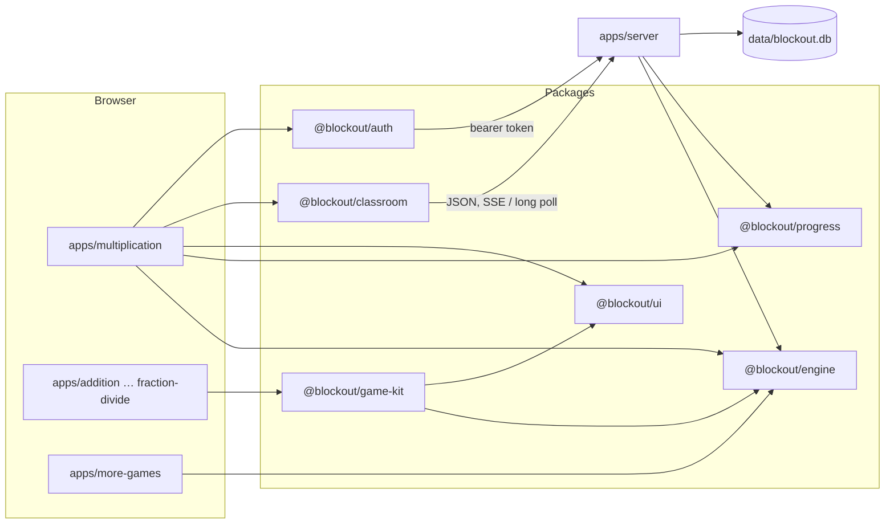

<title>Architecture</title>

# Architecture

Blockout is a [Turborepo](https://turbo.build/) of plain-JavaScript ES modules: small Vite apps that are the games, shared packages, and one Node server. Why it's built this way: [ADR-0001](../decisions/0001-turborepo-monorepo.md).

## The pieces

| Piece | Job |
|---|---|
| `apps/multiplication` | The main game. `src/game/*.js` is the UI, one module per area (board and turns, practice, shop, Wardrobe, classroom screens…); `src/accounts.js` is the account screens. |
| `apps/<operation>` | The other games: each is a page that calls `startGame('<id>')` from `@blockout/game-kit`. |
| `apps/server` | Serves the built apps (multiplication at `/`, the others at `/<name>/`), runs live classes, and the accounts API. Node built-ins only. |
| `@blockout/engine` | Pure game rules: board, placement, dice (including the weighted "pair dice" of Tricky, Master and Legend) and the CPU; the other operations' rules. |
| `@blockout/progress` | Pure rules for everything earned: points and bonuses, the shop's unlock chains, achievements, fact stats, homework goals, cheats and save migrations. The server uses it too. |
| `@blockout/ui` | The shared look (CSS, icons) and a Vite plugin that adds the theme and icons to every page. |
| `@blockout/classroom`, `@blockout/auth` | Browser clients for live classes and for signing in. |

## Live classes

A class lives in the server's memory for the length of a lesson. Every browser gets its own view of it over Server-Sent Events; where a proxy holds event streams back (Cloudflare quick tunnels, some school filters), the page switches to long polling after a few seconds. Room rules (`rooms.js`, `tournament.js`) are pure functions, tested without a server.

## Accounts

Signed-in players' data is in sqlite ([ADR-0003](../decisions/0003-sqlite-with-node-builtin.md)); sign-in goes through one provider interface, dev sign-in now and Keycloak later ([ADR-0002](../decisions/0002-swappable-sign-in.md)). A student's progress is the same save the game keeps in the browser, synced to the server: the server works out class stats and homework from it with `@blockout/progress`, so the rules are the same on both sides.

## The game modules

The multiplication game was one 6,300-line file. It's now split into modules that only declare things when imported and do their load-time work in `run()`, called in a fixed order ([ADR-0005](../decisions/0005-game-modules-run-phase.md)).
