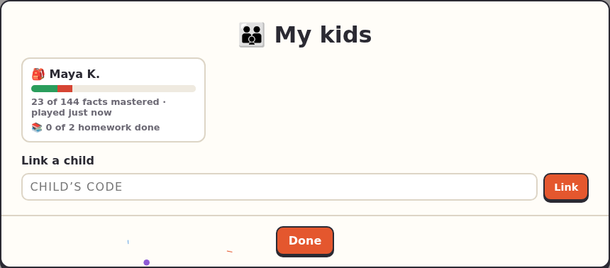

<title>Parents</title>

# Parents

Follow your child's progress and set extra homework.

1. **Sign in** as a parent: **👤 Sign in → 👪 Parent**.
2. **Get your child's code.** It's on their account page (they tap their name at the top of the menu), or ask their teacher.
3. **Link it:** open **👪 My kids**, type the code and tap **Link**.

Tap your child for their page: the Times Table (mastered, learning, needs practice), their homework from the teacher and from you, and what they've played recently. **Add homework** there sets homework just for them; it only offers what they've already unlocked.

What's kept about your child, and who can see it: [Privacy](../privacy.md).
