<title>Playing</title>

# Playing

Everything here works without an account. Progress is saved in the browser; [signing in](#accounts) keeps it with the student instead.

## Single player

Pick **Single player**, a difficulty and a board, and tap **Start game**. Roll, draw the rectangle (drag it out, or click to drop it once *Click to place* is unlocked), and answer. The CPU takes its turn and shows its working.

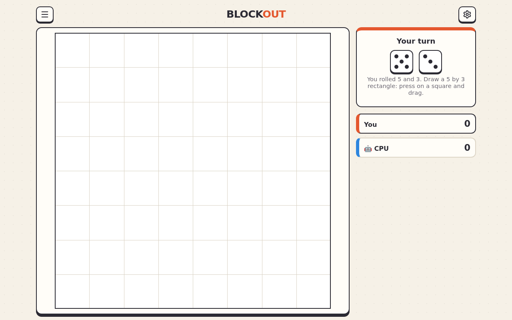

When the board is full, or nobody can place anything, the game ends. The results show the scores; **Show details** has the full stats, and the shop, Wardrobe and stickers are one tap away when there's something new.

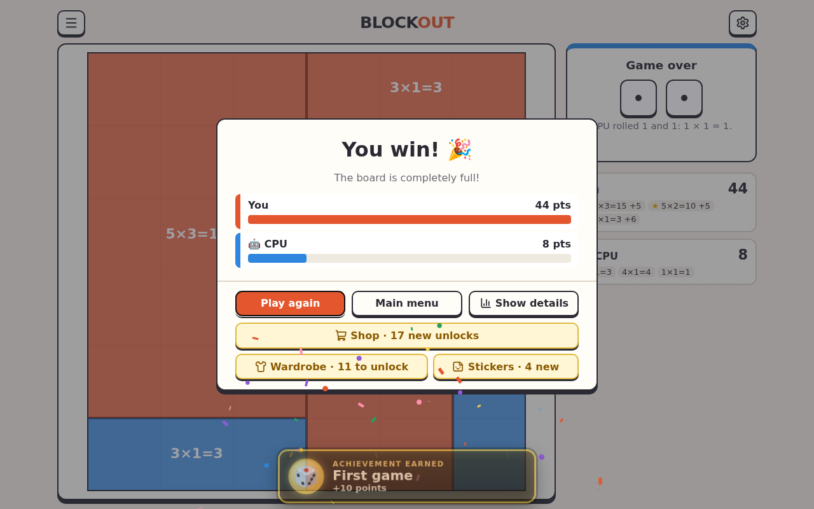

## Practice

**Practice** asks questions without a board, picking the facts that need it most. **Learn** has help; **Expert** has none, doubles the bonus points and can add a timer. Longer rounds (10 or 20 questions) earn a finishing bonus.

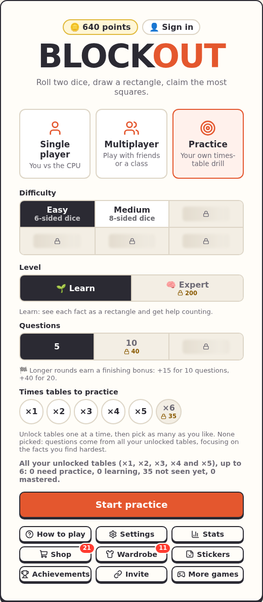

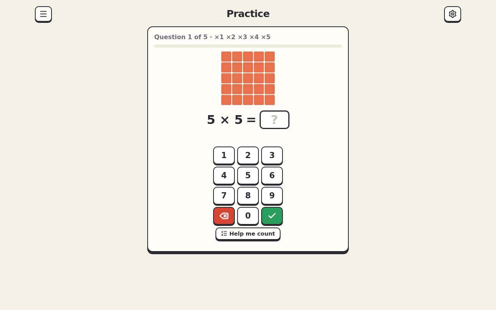

## Difficulties

| Difficulty | The dice |
|---|---|
| Easy | Two 6-sided dice (free) |
| Medium | 8-sided dice |
| Hard | 12-sided dice |
| Tricky | Only the harder facts: 3, 4, 6, 7, 8, 9 and 12 |
| Master | The dice go after your weakest facts |
| Legend | Half the rolls are teens like 14 × 7 (split into 10 × 7 and 4 × 7), half Tricky facts; needs a 12×12 board or bigger |

Each difficulty unlocks when most of the Times Table below it is mastered.

## Points, shop and Wardrobe

Right answers earn points: more for first-try answers, streaks, quick answers on a timer, and finishing bigger boards. Points buy things in the **Shop**: new boards, difficulties, times tables for practice, and settings like auto roll. Unlocks come as a skill tree: only the next step shows its price.

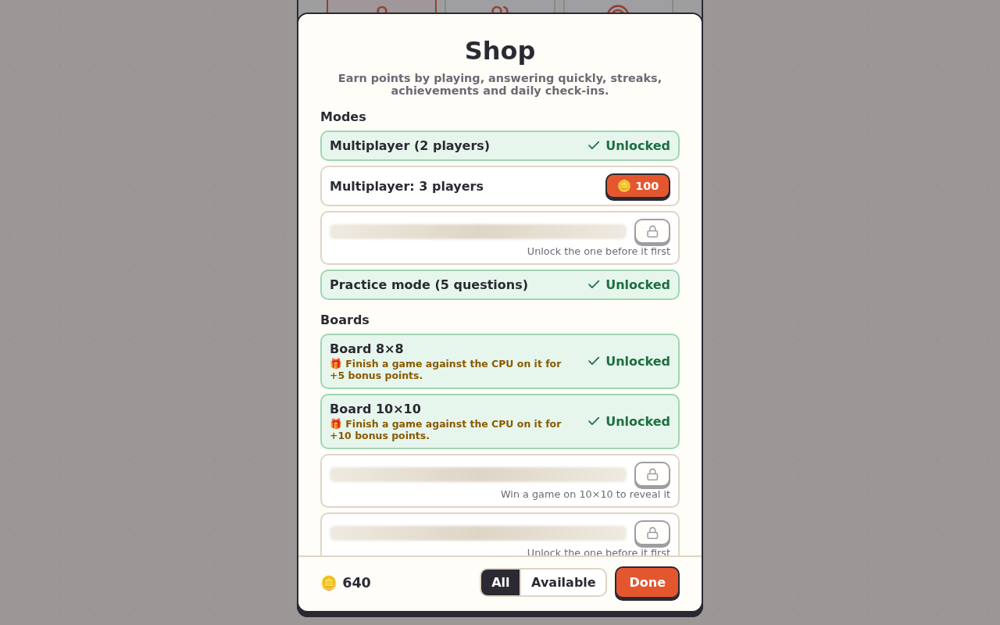

The **Wardrobe** has looks: colours, dice, board themes, keypads and titles.

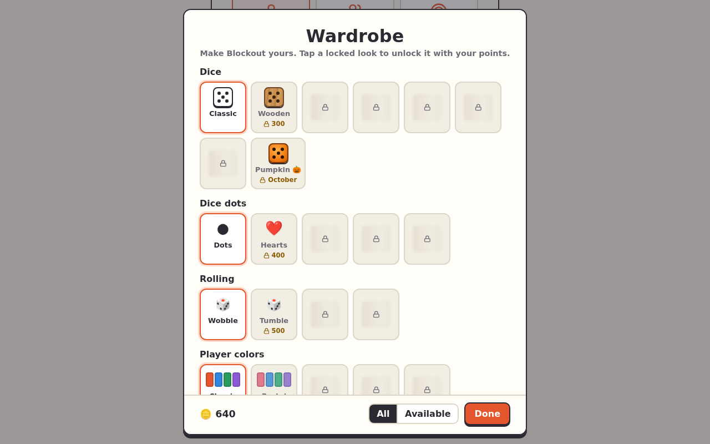

**Stats** shows every game and the Times Table: which facts are mastered, still being learned, or need practice.

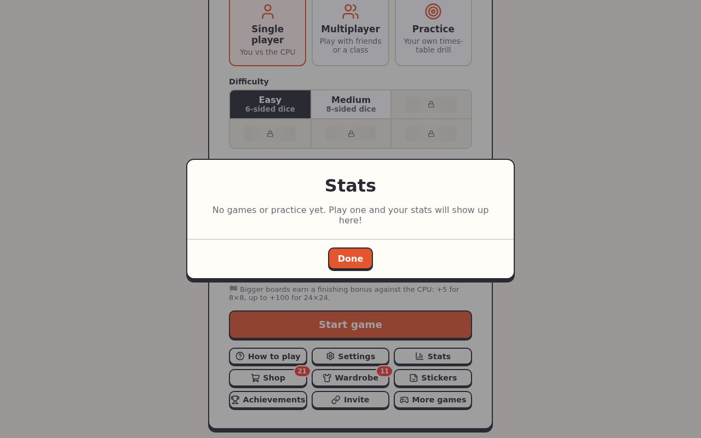

## Home multiplayer

**Multiplayer → Home** is 2–4 players taking turns on one screen. (It's unlocked in the shop.)

## Accounts

Tap **👤 Sign in** at the top of the menu. A student's progress then follows them to any device, and the first time an account is used on a device, that device's guest progress is added to it. Signed-in students see **📚 Homework** on the menu; **Play ›** on a homework starts that game, set up and ready.

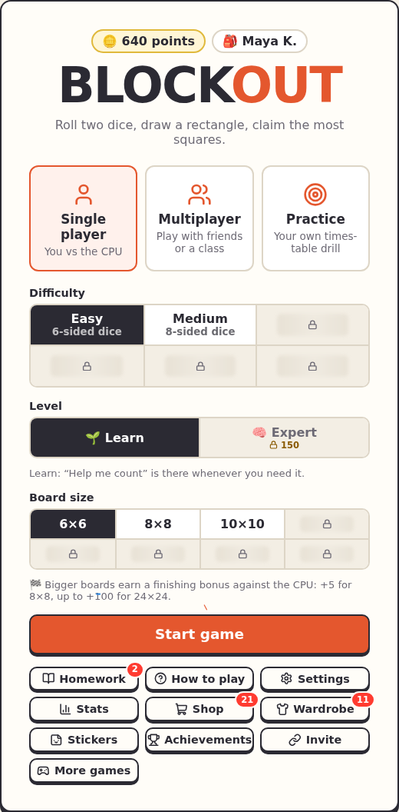

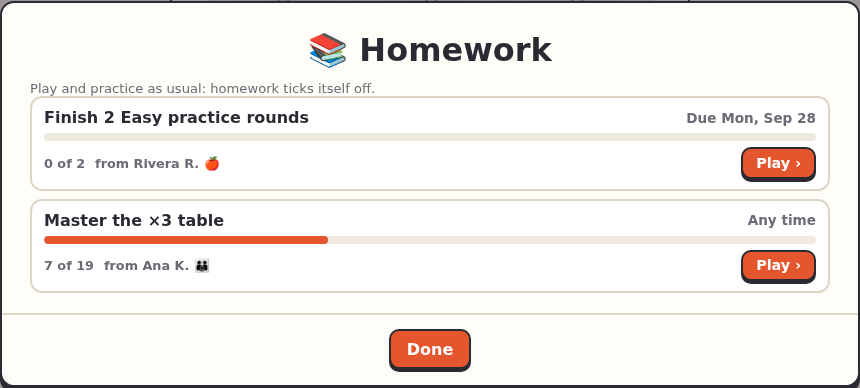

## More games

**More games** on the main menu leads to the same roll, place and answer game for other operations: addition, subtraction, division, and adding, subtracting, multiplying and dividing fractions. Each has Single player and Practice.

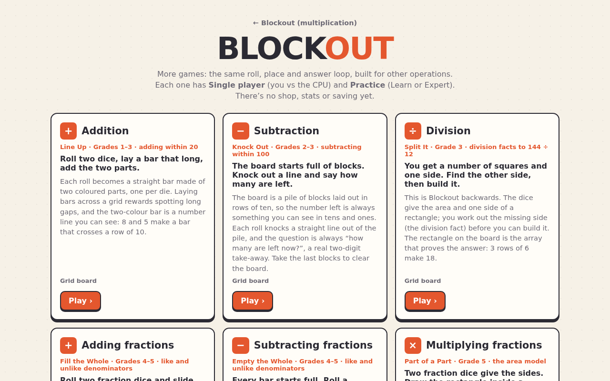

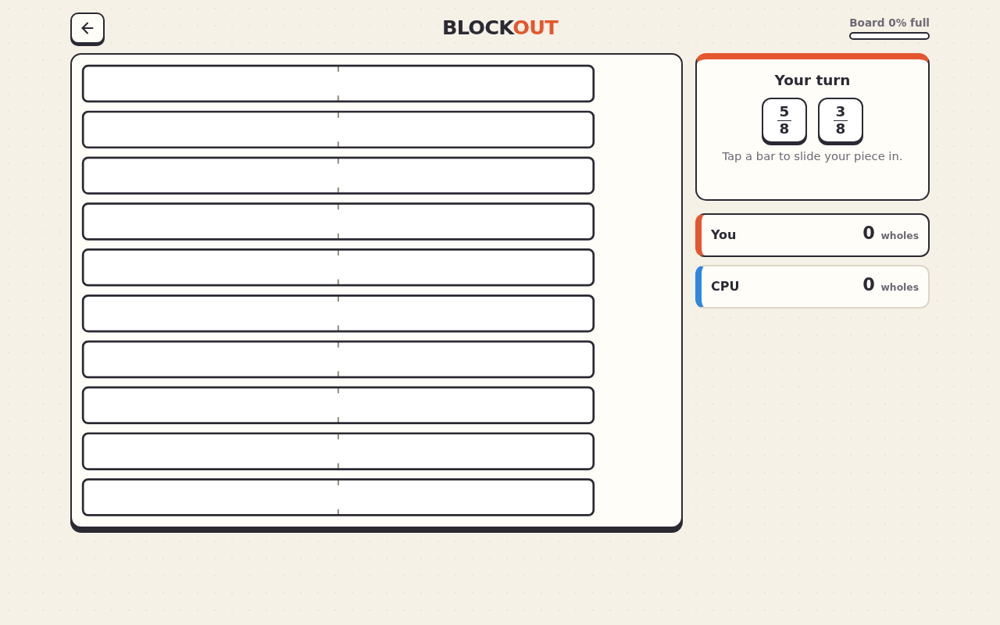

## Cheat codes

Press ++grave++ (the key left of 1) for the cheat code box. Codes are secret; each one found earns a hidden achievement, and the box lists the active ones so they can be switched off. Cheats never work in class games.
