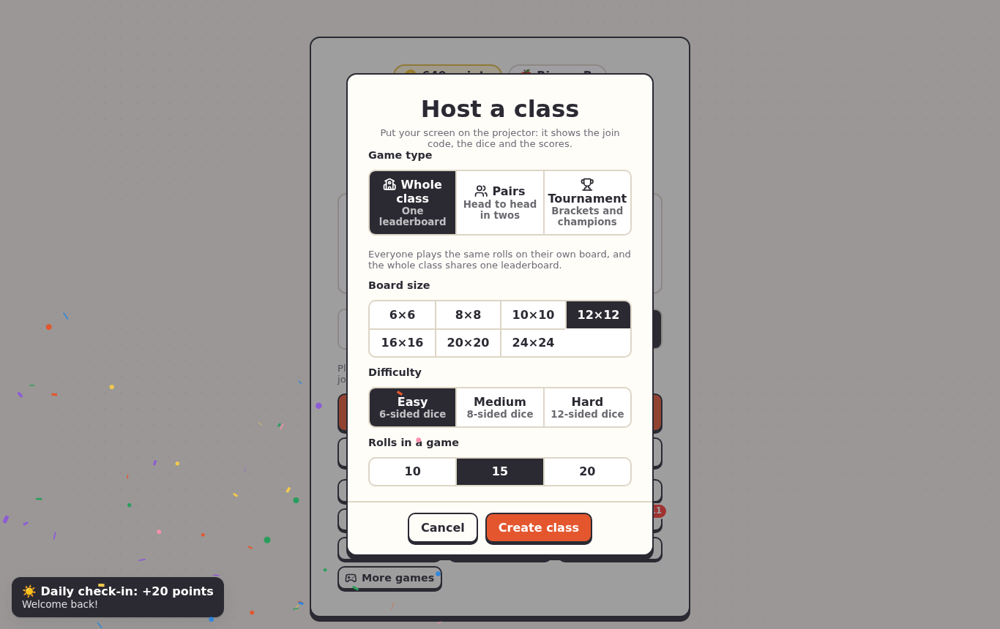
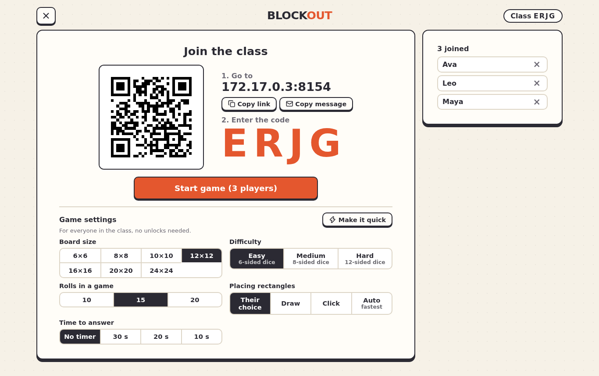
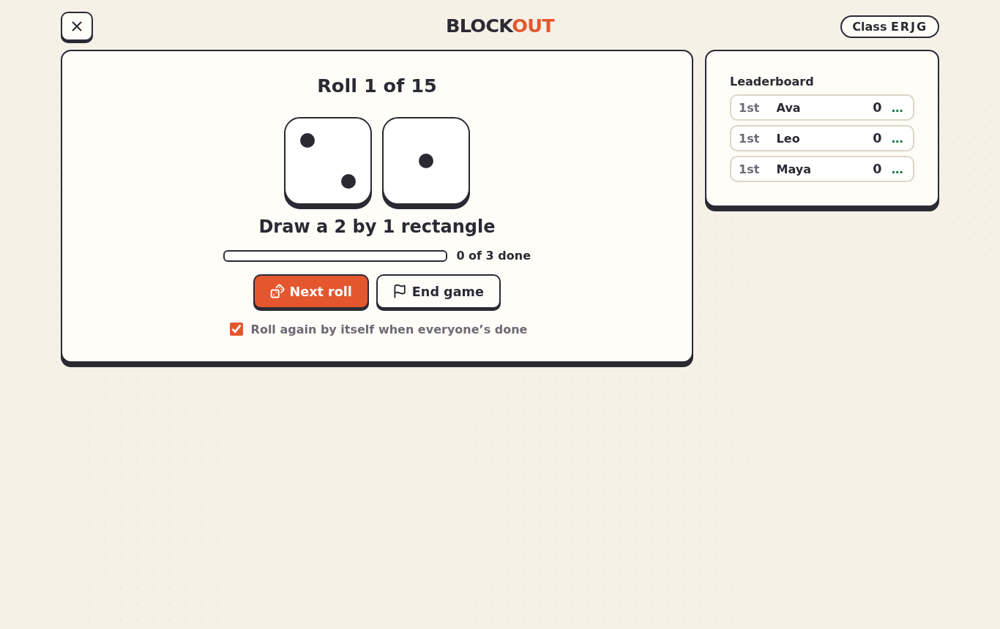
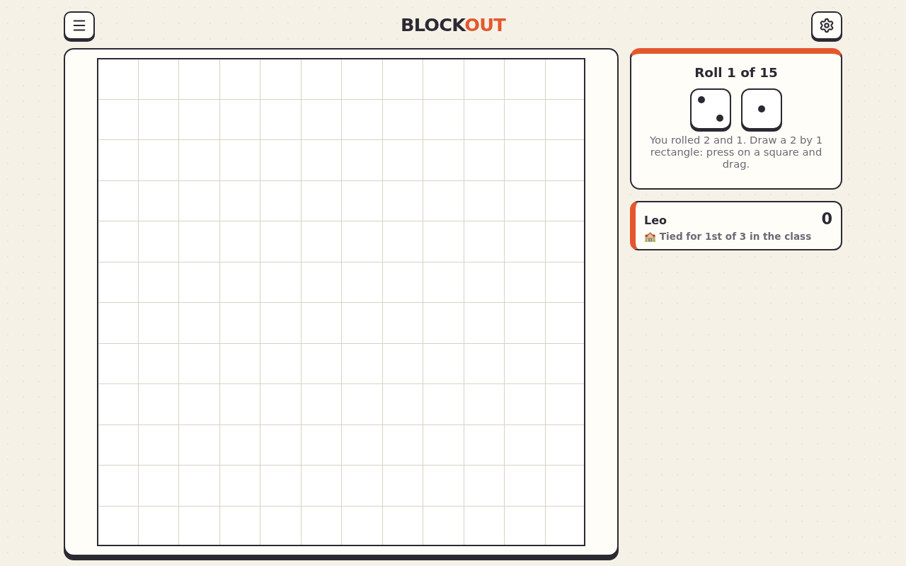
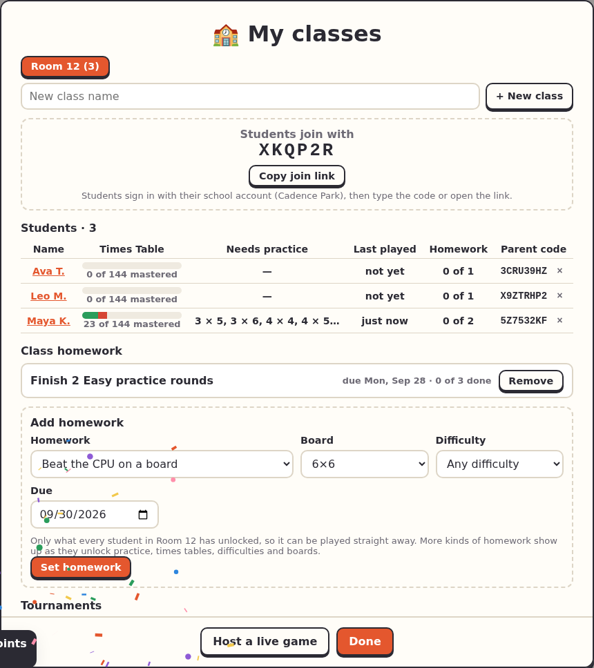
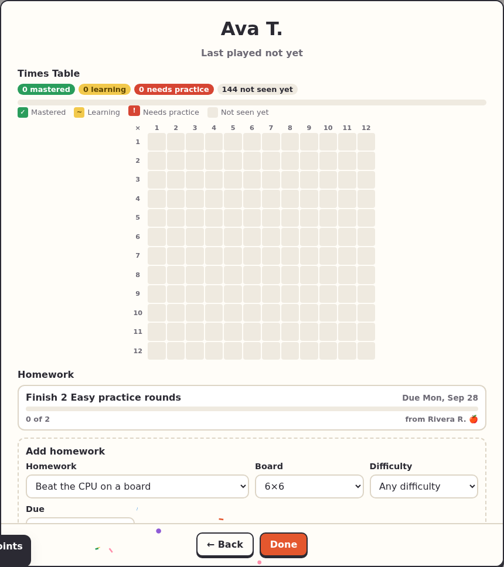

<title>Teachers</title>

# Teachers

Two ways to use Blockout with a class: **live class games** (everyone playing at once, run from your screen) and **your classes** (a class list that lasts, with stats, homework and planned tournaments). Both need a teacher sign-in; students can join live games without one.

## Host a live class game

**Multiplayer → Classroom → Host a class (teacher)**, then choose the kind of game:

| Kind | How it plays |
|---|---|
| Whole class | Everyone plays the same rolls on their own board; your screen rolls and shows the leaderboard |
| Pairs | Students play in twos on a shared board, taking turns. With an odd number, you (on your screen or another device) or the CPU play the odd one out |
| Tournament | Knockout, double elimination, round robin, Swiss or king of the hill, made of short pairs games |

Students join with the 4-letter code, the link, or the QR code. Every setting is free in class games, and **Make it quick** picks settings for a fast lesson.

During the game your screen shows the roll, who's done and the leaderboard; each student plays on their own device.

!!! tip "Students' devices can't reach your computer?"
    Share it through a tunnel: see [Share through a tunnel](share-through-a-tunnel.md).

## Your classes

Open **🏫 My classes** on the main menu and make a class ("Room 12"). It gets a 6-character code and a join link; students sign in with their school account and type the code (or open the link) to join the class list. Any `@iusd.org` student with the code can join.

For each student you see:

- how much of the Times Table is mastered, and which facts need practice
- when they last played, and how their homework is going
- the code for a parent to link their account

Tap a name for their page: the full Times Table, their homework (and a form to set homework just for them) and what they've played recently.

## Homework

**Add homework** sets it for the whole class:

| Homework | Done when |
|---|---|
| Master a times table | Every ×N fact up to 10, both ways round, is mastered |
| Finish practice rounds | That many practice rounds are finished (on a difficulty, or any) |
| Beat the CPU on a board | They win on a board that big or bigger |
| Play games | That many games are finished |

It only offers what every student in the class has already unlocked, so everything can be played straight away. Rounds, wins and games count from when the homework was set, and it ticks itself off as they play.

## Tournaments on a schedule

Under **Tournaments**, plan one for your class or the whole school: a name, a time, the format and the board. When it's due, the lobby opens by itself: you get **Open the lobby** in My classes, and your students see a banner on their menu with a **Join** button.
