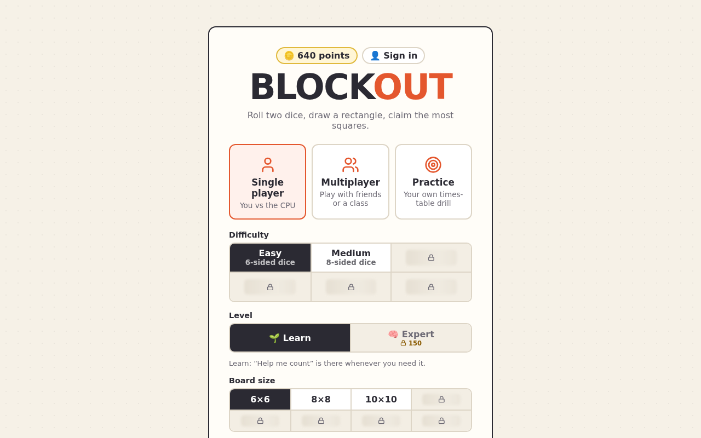

<title>Blockout</title>

# Blockout

A multiplication game for 3rd graders, based on "Blockout" from [Math for Love](https://mathforlove.com/). Roll two dice, draw that rectangle on the grid, say how many squares it is, and claim the most of the board. It runs in the browser, mostly on classroom Chromebooks, and guests can always play without an account.



## The whole idea, in one turn

You roll a 5 and a 3. You draw a 5 × 3 rectangle anywhere it fits, touching what's already on the board, and answer **5 × 3 = 15**. Right first time earns bonus points; stuck, and **Help me count** skip-counts the rectangle with you. The CPU plays the same way and explains its own answers step by step.


## What's in it

<div class="grid cards" markdown>

-   :material-account:{ .lg .middle } **Play and practice**

    ---

    Single player against the CPU, Practice that picks the facts you need most, and Home multiplayer for 2–4 on one screen. Points buy new boards, difficulties and looks.

    [:octicons-arrow-right-24: Playing](../guides/playing.md)

-   :material-school:{ .lg .middle } **Classroom**

    ---

    A whole class on the same rolls, pairs on a shared board, or tournaments, run from the teacher's screen with a join code. Teachers also get class stats, homework and scheduled tournaments.

    [:octicons-arrow-right-24: Teachers](../guides/teachers.md)

-   :material-human-male-child:{ .lg .middle } **Families**

    ---

    Parents link their child's account to see their Times Table and homework, and set extra homework.

    [:octicons-arrow-right-24: Parents](../guides/parents.md)

-   :material-puzzle:{ .lg .middle } **More games**

    ---

    The same roll, place and answer loop for addition, subtraction, division and fractions, each with its own points, shop, achievements and stats.

    [:octicons-arrow-right-24: Playing](../guides/playing.md#more-games)

</div>

## Run it

```console
$ npm install
$ npm start
```

Then open http://localhost:8080. [Quickstart](quickstart.md) walks through your first class; [Installing](../project/installing.md) has the details.
