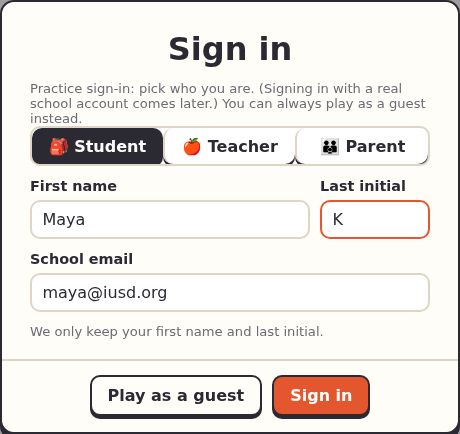
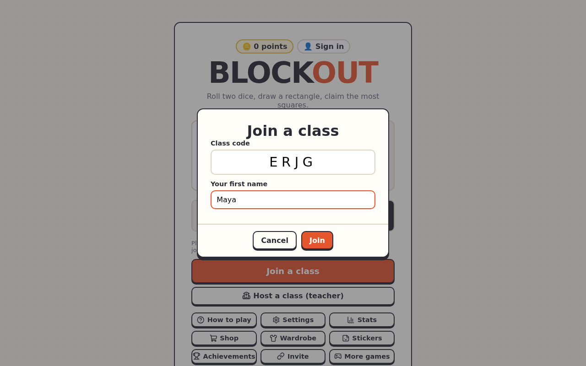

<title>Quickstart</title>

# Quickstart: run your first class

By the end you'll have hosted a whole-class game on your computer, with students joining from other browser windows.

## 1. Start Blockout

In the project folder:

```console
$ npm install
$ npm start
```

Open http://localhost:8080. You'll see the main menu.

## 2. Sign in as a teacher

Tap **👤 Sign in** at the top, choose **🍎 Teacher**, type a first name and last initial, pick **Cadence Park**, and tap **Sign in**. The chip at the top now shows your name.

{ width="460" }

!!! note "Practice sign-in"
    This is the "dev sign-in": anyone can pick any name and role. Real school sign-in comes with Keycloak (see [Switch sign-in to Keycloak](../guides/set-up-keycloak.md)).

## 3. Host a class

Choose **Multiplayer → Classroom → Host a class (teacher)**, keep **Whole class**, and tap **Create**.


## 4. Join as students

Open a couple of private windows at the address on the teacher's screen. In each, choose **Multiplayer → Classroom → Join**, type the code and a first name, and tap **Join**. (A link or the QR code fills in the code for you.)



The names appear in the teacher's lobby:


## 5. Play

Tap **Start**. Each roll shows on the teacher's screen, with a leaderboard, and every student plays it on their own board. When everyone is done, the next roll comes by itself.


After the last roll the teacher's screen shows the podium and the facts the class found hardest.

## Next

- Share it with real Chromebooks: [Share through a tunnel](../guides/share-through-a-tunnel.md).
- Keep a class from lesson to lesson, set homework and plan tournaments: [Teachers](../guides/teachers.md).
